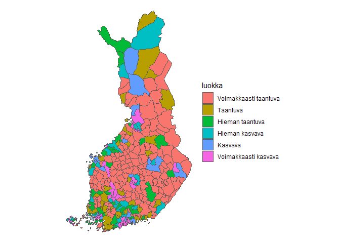
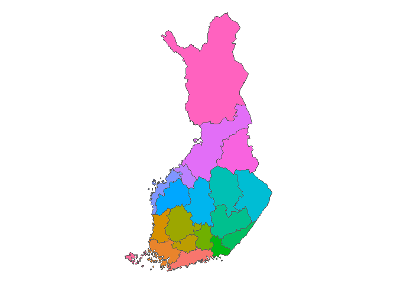

<!-- README.md is generated from README.Rmd. Please edit that file -->

# rfinstats

<!-- badges: start -->
<!-- badges: end -->

This package contains some data sets from finnish statistial institute.

## Installation

You can install the development version of rfinstats from
[GitHub](https://github.com/) with:

``` r
# install.packages("devtools")
devtools::install_github("StranMax/rfinstats")
```

``` r
library(rfinstats)
library(dplyr)
library(sf)
library(ggplot2)
```

``` r
head(taantuvat)
#> # A tibble: 6 × 5
#>   kunta     vaesto kokmuutos_2010_2022 suht_muutos_2010_2022 luokka             
#>   <chr>      <dbl>               <int>                 <dbl> <fct>              
#> 1 Akaa      16811.                -385                 -2.29 Hieman taantuva    
#> 2 Alajärvi   9876.               -1390                -14.1  Voimakkaasti taant…
#> 3 Alavieska  2630.                -329                -12.5  Voimakkaasti taant…
#> 4 Alavus    11831                -1484                -12.5  Voimakkaasti taant…
#> 5 Asikkala   8268.                -537                 -6.49 Taantuva           
#> 6 Askola     4950.                 -68                 -1.37 Hieman taantuva
```

``` r
taantuvat_sf <- left_join(taantuvat, kunnat) |> st_as_sf()
#> Joining with `by = join_by(kunta)`
```

``` r
ggplot() +
  geom_sf(data = taantuvat_sf, aes(fill = luokka)) +
  theme_void()
```



``` r
aluejaot_sf <- left_join(aluejaot, kunnat) |> st_as_sf()
#> Joining with `by = join_by(id, kunta)`
```

``` r
aluejaot_sf |>
  group_by(Maakunta) |>
  summarise(n = n(), do_union = TRUE) |>
  ggplot() +
  geom_sf(aes(fill = Maakunta), show.legend = FALSE) +
  theme_void()
```


